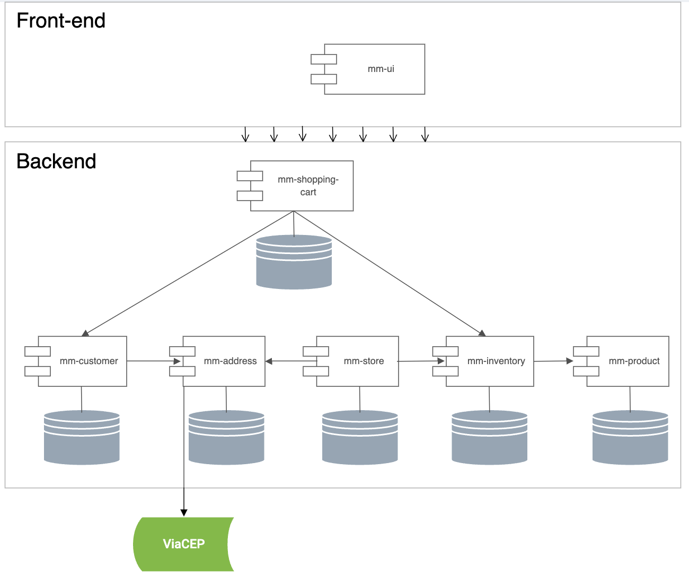

```
PUC-Rio
Especialização em Desenvolvimento Fullstack
Disciplina: Desenvolvimento Back-end Avançado

Aluno: Rodrigo Alves Costa
```

## Table of Contents

- [Related Market Master Microservices](#related-market-master-microservices)
- [Market Master: Architecture Diagram](#market-master-architecture-diagram)
- [Live Demo](#live-demo)
- [Quick Start](#quick-start)
  - [Prerequisites](#prerequisites)
  - [Installation and Configuration](#installation-and-configuration)
- [Functionality Overview](#functionality-overview)
- [How to Use](#how-to-use)
- [Contributing](#contributing)

## Market Master: UI
The `mm-ui` service is part of the Market Master project, a suite of microservices designed to manage various aspects of a supermarket e-commerce platform. This service handles the product front-end and its various connections to the microservices and their respective interactions.

### Related Market Master Microservices:
- [mm-product](https://github.com/MarketMasterPlus/mm-product) — Product (item registry) Management
- [mm-store](https://github.com/MarketMasterPlus/mm-store) — Store Management
- [mm-address](https://github.com/MarketMasterPlus/mm-address) — Address Management with ViaCEP API integration
- [mm-customer](https://github.com/MarketMasterPlus/mm-customer) — Customer/User Management
- [mm-shopping-cart](https://github.com/MarketMasterPlus/mm-shopping-cart) — Shopping Cart Management
- [mm-pact-broker](https://github.com/MarketMasterPlus/mm-pact-broker) — Pact Broker for Contract tests
- [mm-ui](https://github.com/MarketMasterPlus/mm-ui) — User Interface for Market Master

## Market Master: Architecture Diagram
This diagram illustrates the relationship between the front-end and the various backend services of the Market Master project.



### ViaCEP Integration
The `mm-address` service integrates with the [ViaCEP API](https://viacep.com.br/) to fetch address details based on postal codes. The service provides a single endpoint to fetch address details by postal code.

In the mm-address service code, the ViaCEP integration is implemented with an endpoint that will fetch address details based on the postal code provided. 

The endpoint will validate the postal code format and fetch the address details from the ViaCEP API. The response will include the street, city, state, neighborhood, and complement of the address.

``sh
curl http://localhost:5000/mm-address/viacep/01001000
``

```json
{
    "street": "Rua dos Bobos",
    "city": "Rio de Janeiro",
    "state": "RJ",
    "cep": "22290-080",
    "neighborhood": "Copacabana",
    "complement": "de 201 a 233 - lado ímpar"
}
```

## Live Demo
You can see a 5-minute live demo of this project here:
    [](https://www.youtube.com/watch?v=1Q1Q1Q1Q1Q1Q)

## Quick Start for the entire Market Master project

This section provides instructions for quickly setting up the entire Market Master project using Docker Compose.

Create a superdirectory to hold all the Market Master services:

```sh
mkdir market-master
cd market-master
```

Create a bash script to start all services in detached mode:
```sh
#!/bin/bash

declare -a directories=("mm-address" "mm-customer" "mm-inventory" "mm-product" "mm-shopping-cart" "mm-store" "mm-ui")

for dir in "${directories[@]}"
do
  echo "Starting containers in $dir in detached mode..."
  cd "$dir"
  docker compose up -d "$@"
  cd ..
done
```

Run the script to start all services:
```sh
chmod +x start-all.sh
./start-all.sh
```

You can also create a stop script to stop all services:
```sh
#!/bin/bash

declare -a containers=("mm-address" "mm-address-db" "mm-customer" "mm-customer-db" "mm-inventory" "mm-inventory-db" "mm-product" "mm-product-db" "mm-shopping-cart" "mm-shopping-cart-db" "mm-store" "mm-store-db" "mm-ui")

for container in "${containers[@]}"
do
  echo "Stopping $container..."
  docker stop "$container"
done
```

## Quick Start for mm-ui

This section provides instructions for quickly setting up the `mm-ui` using Docker Compose.

### Prerequisites
- Docker and Docker Compose installed on your machine.

### Running the Service
To start the `mm-ui` along with its dependent services, follow these steps:

1. Clone the repository if you haven't already:
   git clone https://github.com/MarketMasterPlus/mm-ui
   
2. Navigate to the project directory:
   cd mm-ui
   
3. Start all related services using Docker Compose:
   docker-compose up --build

This will build and start all the services defined in the `docker-compose.yml` file, making the UI accessible at [http://localhost:5702](http://localhost:5702).

## Functionality Overview

The `mm-ui` provides interfaces for:
- **Store Management**: View, add, and manage supermarket stores.
- **Product Management**: Manage products including their inventory, pricing, and category.
- **Customer Management**: Handle customer registrations, profiles, and authentication.
- **Shopping Cart Management**: Manage active shopping carts for logged-in customers.
- **Address Lookup**: Integrate with the ViaCEP API to fetch address details.

## How to Use

After launching the services, you can navigate to the UI through your browser at `http://localhost:5702`. Here you can register as a new user or log in with existing credentials to access the various functionalities. Bear in mind that this UI component is not fully functional without the backend services running.

## Installation and Configuration
After launching the services, you can navigate to the UI through your browser at `http://localhost:5702`. Here you can register as a new user or log in with existing credentials to access the various functionalities. Bear in mind that this UI component is not fully functional without the backend services running.

## Installation and Configuration

1. **Clone the repository**:
    ```sh
    git clone https://github.com/your-repo/mm-ui.git
    cd mm-ui
    ```

2. **Create and configure the `.env` file**:
    - In the root directory of the project, create a file named `.env`.
    - Add the necessary environment variables to the `.env` file. Below is an example configuration:
        ```env
VITE_MM_CUSTOMER_API_URL=http://localhost:5701
VITE_MM_ADDRESS_API_URL=http://localhost:5700
VITE_MM_STORE_API_URL=http://localhost:5703
VITE_MM_PRODUCT_API_URL=http://localhost:5704
VITE_MM_INVENTORY_API_URL=http://localhost:5705
        ```
    - You can rename the .env.example file to .env and update the values as needed.
    ```sh
    cp .env.example .env
    ```

3. **Install dependencies**:
    ```sh
    npm install
    ```

4. **Start the development server**:
    ```sh
    npm run dev
    ```

5. **Build the project for production**:
    ```sh
    npm run build
    ```

6. **Run with Docker**:
    - Ensure Docker is installed and running on your machine.
    - Build and start the services using Docker Compose:
        ```sh
        docker-compose up --build
        ```

## Contributing

Contributions to the `mm-ui` project are welcome. Please ensure to follow the existing coding standards and submit pull requests for any new features or bug fixes.

## License

This project is licensed under the MIT License - see the [LICENSE.md](LICENSE.md) file for details.

## Additional Information

For more details on the individual microservices or to report issues, please refer to the respective repositories or open issues in this repository.
